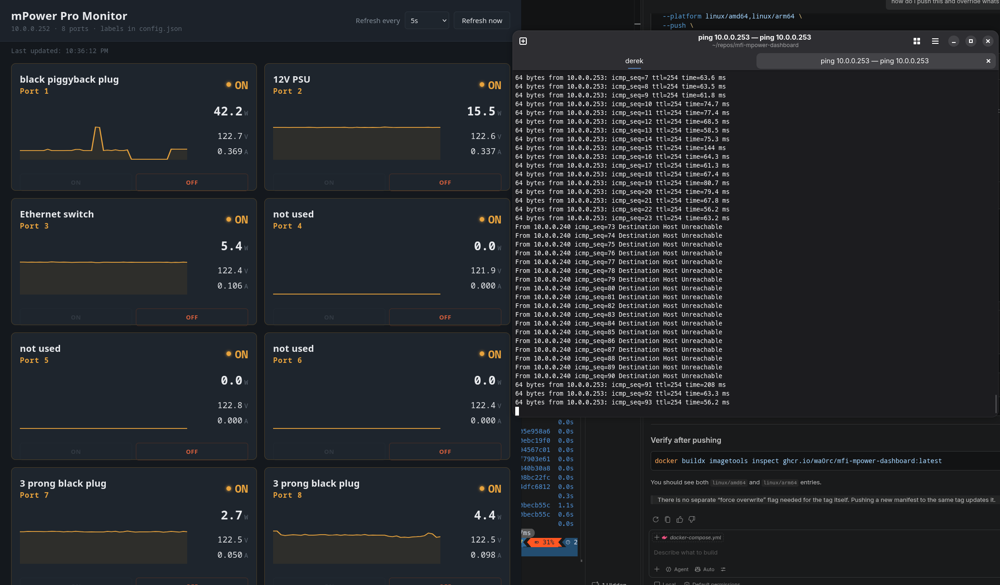

# mPower Pro Power Dashboard

A small, self-contained Flask web server that shows live status for all 8
ports on a Ubiquiti mFi mPower Pro power strip: on/off state, wattage,
voltage, current, and a rolling sparkline of power draw per port. Runs on
port 8081.

Because this device's firmware (2.1.11, from 2015) only supports very old
TLS and SSH crypto, the dashboard talks to it over SSH using legacy
key-exchange/cipher settings, and reads/writes port state directly via
`/proc/power/*` on the device rather than through its web UI or the
`mficlient`/`mfi-mpower` PyPI packages (both of which turned out not to work
against this specific firmware).

## Files

- `dashboard.py` - the server and the dashboard's HTML/CSS/JS (all in one file)
- `config.json` - per-port labels and hover tooltips (auto-created with defaults on first run if missing)

## Requirements

- Python 3.9+ (matches what's already on the Pi)
- Network access to the mPower Pro at its configured IP (default `10.0.0.252`)
- SSH access to the device with its username/password (default `ubnt` / `ubnt`)

### Python packages

| Package | Purpose |
|---|---|
| `flask` | Serves the dashboard page and the JSON API |
| `asyncssh` | Legacy-compatible SSH client used to read/write port state |

`asyncssh` pulls in `cryptography` and a couple of smaller dependencies
automatically - no need to install those separately.

## Setup

Create a dedicated virtual environment (keeps these packages separate from
anything else on the system):

```bash
python3 -m venv ~/power-dashboard-venv
```

Install the two required packages into it:

```bash
~/power-dashboard-venv/bin/pip3 install flask asyncssh
```

Put `dashboard.py` and `config.json` in the same directory, e.g.:

```bash
mkdir -p ~/power-dashboard
cp dashboard.py config.json ~/power-dashboard/
cd ~/power-dashboard
```

## Running it

### Local Python

```bash
~/power-dashboard-venv/bin/python3 dashboard.py
```

Or activate the venv first and run it normally:

```bash
source ~/power-dashboard-venv/bin/activate
python3 dashboard.py
```

### Docker

1. Copy the example config file and edit it with your device settings:

```bash
cp config.example.json config.json
```

2. Build and run the container:

```bash
docker compose -f docker-compose.example.yml up --build
```

The compose file mounts `config.json` into the container as a read-only volume.

### Multi-arch build for GHCR

To publish a single image that supports both `linux/amd64` and `linux/arm64`
(for example, a desktop machine and a Raspberry Pi), use Docker Buildx:

```bash
docker run --privileged --rm tonistiigi/binfmt --install all
```

If the Buildx builder does not already exist, create it:

```bash
docker buildx create --name multiarch --use
```

If it already exists, reuse it instead:

```bash
docker buildx use multiarch
```

Then bootstrap and build/push the multi-arch image:

```bash
docker buildx inspect --bootstrap
docker buildx build \
  --platform linux/amd64,linux/arm64 \
  --push \
  -t ghcr.io/wa0rc/mfi-mpower-dashboard:latest \
  -t ghcr.io/wa0rc/mfi-mpower-dashboard:v0.0.1 \
  .
```

This replaces the existing GHCR tags with the new multi-arch manifests.

Then visit `http://<pi-ip-address>:8081/` from any browser on the same
network (not the mPower device's own IP - your Pi's address).

Leave the terminal open, or run it under `screen`/`tmux`/a systemd service
if you want it to keep running after you disconnect.

## Configuring port labels and tooltips

Edit `config.json` in the same directory as the script - it's re-read on
every page refresh, so changes show up without restarting the server:

```json
{
  "1": { "label": "Server Rack", "tooltip": "Main homelab PDU feed", "enabled": true },
  "2": { "label": "Router", "tooltip": "", "enabled": true },
  "3": { "label": "Test Device", "tooltip": "Disabled for now", "enabled": false }
}
```

Leave `tooltip` as an empty string to skip showing one for that port.
If `enabled` is omitted, it defaults to `true`. When `enabled` is `false`,
the ON/OFF buttons are replaced with a small "control disabled" banner.

## Device connection settings

If the mPower Pro's IP address or credentials change, edit the constants
near the top of `dashboard.py`:

```python
HOST = "10.0.0.252"
USERNAME = "ubnt"
PASSWORD = "ubnt"
```

## Screenshot



*Port 1 was turned on, then turned off, then lost ping, and finally turned back on with ping recovered.*

## Notes

- The dashboard only polls the device when someone has the page open -
  refreshing (manual button or the interval dropdown) is what triggers a
  read, so there's no background polling loop hammering the device.
- The server keeps one persistent SSH connection open and reuses it across
  requests, reconnecting automatically if it drops.
- The power-history sparklines are stored in memory on the server (shared
  across anyone viewing the dashboard) and reset if the server restarts.
